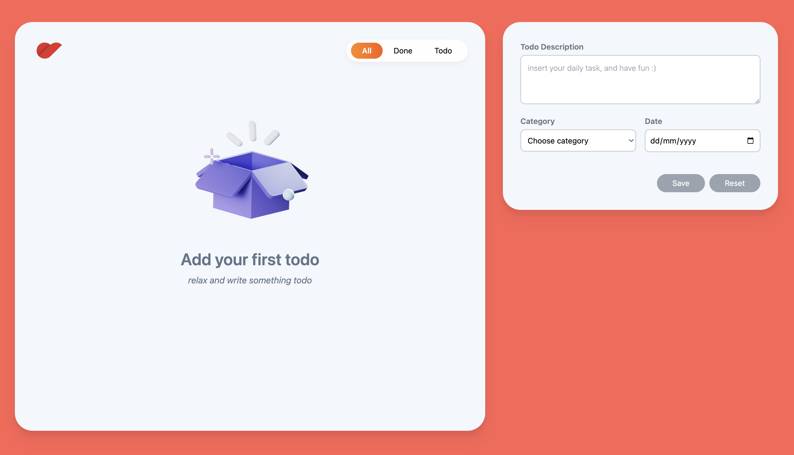
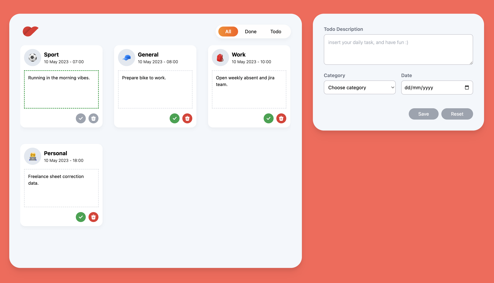
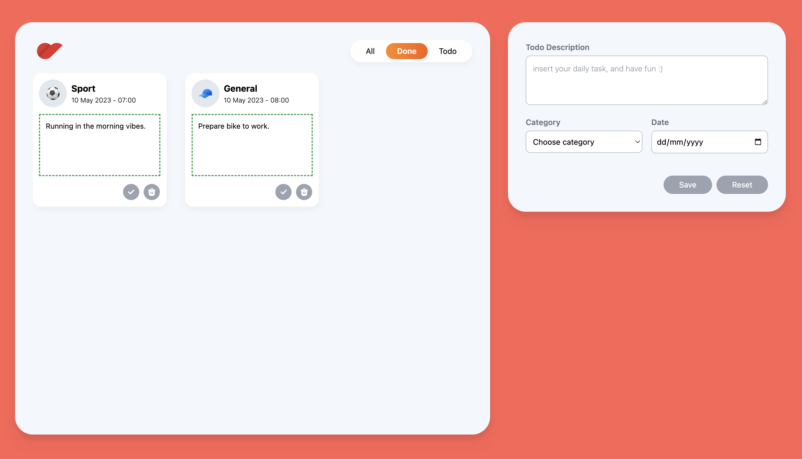

# Todo List Application

## Requirements
- Node version > 18
- Vite
- Yarn

## Get Started

- Clone this project 
- Yarn install
- Yarn dev
- Running in port :8000

## Feature
- Crate Todo
- View List Todo
- Delete Todo
- Done Todo
- Filter by Category

## Screenshot

  

  

  

